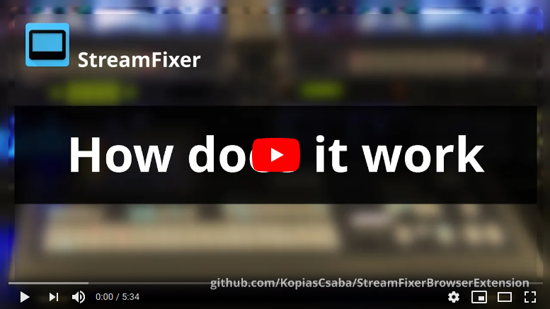
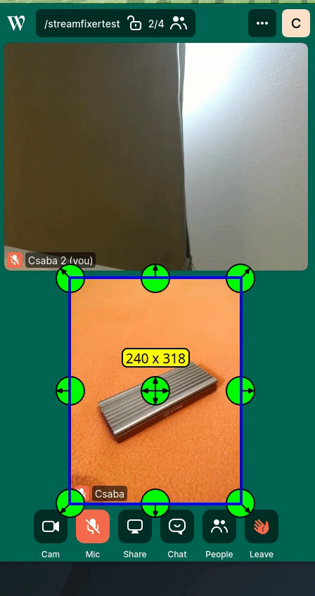
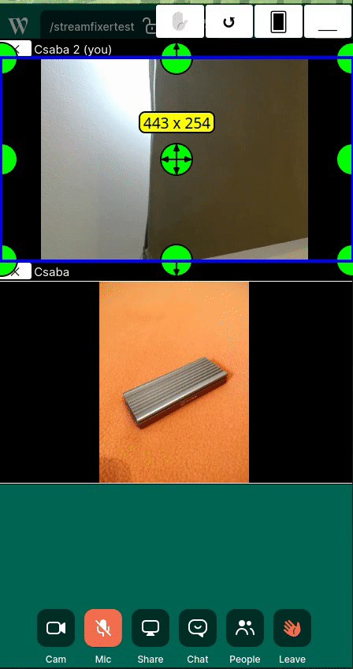
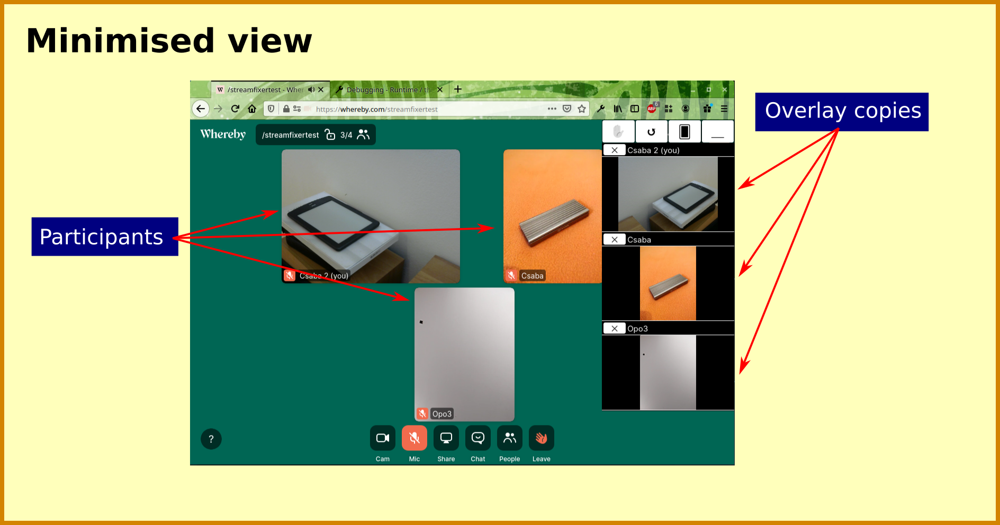
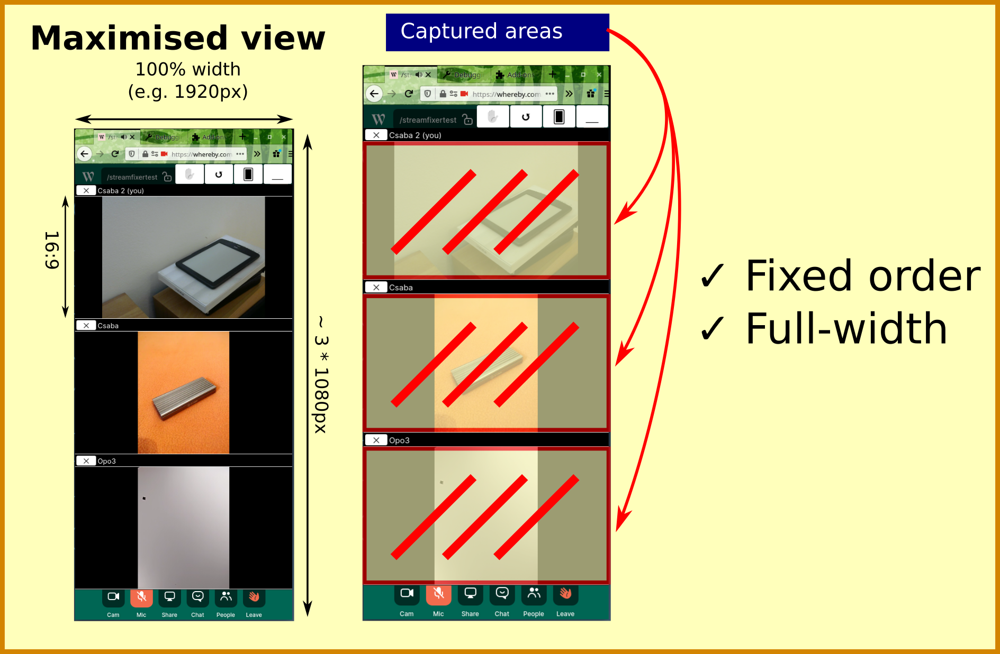

# Table of contents
 * [The problem](#the-problem)
 * [The solution](#the-solution)
 * [Screenshots](#screenshots)
 * [Supported sites](#supported-sites)
 * [Install](#install)
 * [Known bugs](#known-bugs)
 * [More information](#more-information)

# Stream Fixer Firefox & Chrome extension
 	
This extension is for you, if you want to broadcast a video chat to your audience from a streaming software like  [OBS](http://obsproject.com), vMix, XSplit, Wirecast.

By extracting every video stream on supported webpages and putting them in a fixed order into an overlay,
you'll have a much easier time grabbing the required part of the window.

Because the order is fixed, joining or quitting users will not change the layout.

Also, the overlays are placed in a 16:9 full-width box therefore the quality of the video is as high as it can be.

Watch how to live stream an online conferece:

 
 
# The problem
When you want to broadcast participants from a video call, you will face the problem, 
that you have no real and reliable way to get every participant's stream separately into your streaming software.

Skype offers [NDI](https://support.skype.com/en/faq/FA34853/what-is-skype-for-content-creators), that is almost a awesome, but it has two problems:
 * It only works on windows
 * It resizes if the participant's network quality changes drastically
 * ... and you might want to use another service wich offers better A/V quality

You can "window capture" any video conferencing solution, but they are usually not designed with that in mind.
When participants joining, leaving (or just speaking) the layout usually changes, not to mention if
you close the window and start it again tomorrow. 
The participant's streams are not always as big as they could be, therefore losing quality.

See, how the layout changes when someone joins:

# The solution
StreamFixer offers a solution for that problem by creating a full-width fixed order single column list from the streams available.

When someone joins, they will be put to the end of the stack.
If they were already here, they will be put back where they were before. (Matched by name)

# Screenshots

# Supported sites
 * [http://whereby.com](http://whereby.com)
 * [http://meet.jit.si](http://meet.jit.si)
 
Suggest other services as issue if you need them, it is easy to add support for a page that fits the conditions.

# Install
 * Install the Firefox extension here: [https://addons.mozilla.org/en-US/firefox/addon/streamfixer/](https://addons.mozilla.org/en-US/firefox/addon/streamfixer/)
 * Install the Chrome extension here: *coming soon*

# Tips
 * Many linux window manager supports dragging the window by pressing some hotkey, usually alt. XFCE and KDE surely, 
   so when you have the oversized window, you quickly can drag&drop it by alt+clicking.
    * For windows, you might want to check out [AltDrag](https://stefansundin.github.io/altdrag/) for the same functionality
 * Don't minimize the browser while you capturing it, at least on linux the window capture pauses while the window is minimized.
 
 
# Known bugs
 * Flashing when two or more participants have the same name
    * Solution: Never have participants with the same name.
 * When someone joins every view flashes once
    * Solution: there is none yet
 * When someone leaves, the overlay image remains there, but upon the next event it turns to black. I'm not even sure what would be good: keep it there, or turn it to black immediately.
    * Solution: there is none yet

# Contribute
Feel free to open issues, PR-s or just leave your comments or ideas in the issues.

More information about development can be found in the [docs/development.md](docs/development.md) file.